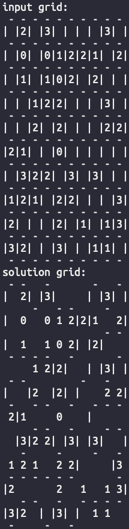

# Loopy

## Inspiration

The Loopy puzzle on the Genius Puzzles app on iOS is a very fun and challenging time sink which stretches your deductive reasoning.
I recommend checking it out before using this solver. The basic idea of this puzzle is to mark one loop that goes by each numbered constraint exactly the specified number of times.


I was stuck on one of the square grid levels and thought about the strategies I was using to solve it, and realized that this can be generalized to an optimization problem. I converted the puzzle into a set of constraints and was pleasantly surprised that the program solves the puzzle!

## Implementation

The puzzle can be represented as a set of vertices and connecting edges that form the grid.

Each edge can either be marked (part of the loop) or unmarked, and are our decision variables.

The three constraints are:
1. Cycle constraint: for each vertex, the number of marked, connecting edges is either 0 or 2
2. Box constraint: each grid box, represented by 4 edges, must have an exact number of edges marked if specified
3. One cycle: the marked edges must form a single cycle.

I was not able to linearize the third constraint, so instead, I pruned solutions if the number of cycles in the resulting output is greater than 1.

## Usage

To solve a puzzle like the one above, convert it into a text file as below:
```
10
10
_2_3____3_
_0_01221_2
_1_102_2__
__122___3_
__2_2___22
21__0_____
_322_3_3__
121_22___3
2___2_1_13
32__3__11_
```
The first two lines represent the number of rows and columns of the grid.
The rest of the file should match the loopy puzzle, with `_` denoting an empty square.

Make sure the required PuLP library (an LP modeler) is installed:
```
$ python3 -m pip install pulp
```

Run the solver with the input file as an argument:
```
$ ./loopy_solver.py <filename>
or
$ python3 loopy_solver.py <filename>
```

Here is the relevant portion of the solver output:


